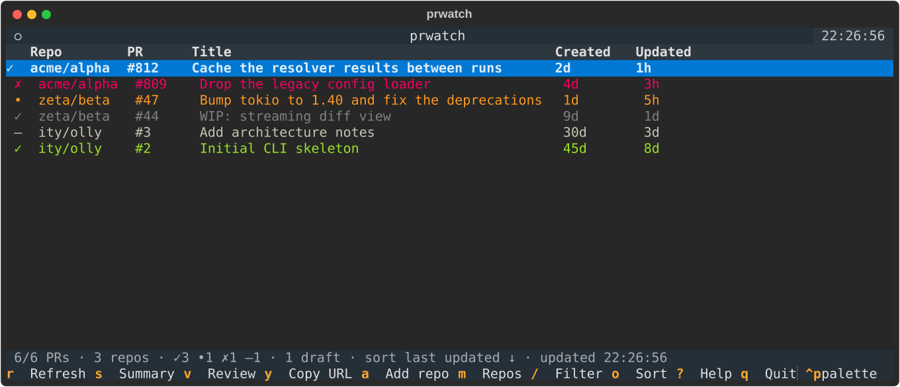

# prwatch

A terminal dashboard for the open pull requests across a set of GitHub
repositories, with one keypress to hand a PR to `claude` or `copilot` for a
summary or a review.



Row colour is the CI state of the PR's head commit:

| colour | meaning                              |
| ------ | ------------------------------------ |
| green  | all checks passed                    |
| yellow | checks pending                       |
| red    | at least one check failed or errored |
| grey   | draft PR (whatever the checks say)   |
| white  | no checks reported for the commit    |

The leading glyph column (`✓ • ✗ –`) repeats the same information for when
colour alone is not enough.

## Install

```sh
git clone <this repo> && cd prwatch
python -m venv .venv && .venv/bin/pip install -e .
.venv/bin/prwatch
```

Or, with [uv](https://docs.astral.sh/uv/): `uv tool install .` and then just
`prwatch`.

## Authentication

prwatch talks to the GitHub GraphQL API. The token **never lives in the config
file** — it is read from the environment, in this order:

1. `$PRWATCH_GITHUB_TOKEN`, then `$GITHUB_TOKEN`, then `$GH_TOKEN`
2. `gh auth token`, if the [GitHub CLI](https://cli.github.com) is installed
   and logged in

```sh
export GITHUB_TOKEN="ghp_..."   # in ~/.bashrc, a password manager hook, etc.
prwatch
```

To read a differently-named variable — say one per GitHub host — name it in the
config with `token_env = "WORK_TOKEN"`; that variable is then checked before
the three above. Only the *name* goes in the file, never the value. A config
file containing a literal `token = "..."` is rejected at startup with a message
telling you to move it to the environment.

A classic PAT needs the `repo` scope for private repositories (`public_repo`
is enough for public ones); a fine-grained token needs read access to
*Pull requests*, *Contents* and *Checks*.

## Usage

```sh
prwatch                       # the TUI
prwatch add owner/name ...    # watch repos (URLs and git@ remotes work too)
prwatch remove owner/name     # stop watching (alias: rm)
prwatch list                  # print the watched repos (alias: ls)
prwatch config                # print the config file path
prwatch --config path.toml …  # use a different config file
```

### Keys

| key       | action                                       |
| --------- | -------------------------------------------- |
| `r`       | refresh now (also on a timer, see below)     |
| `a`       | add a repository                             |
| `m`       | manage repositories (add / remove)           |
| `s`       | summarise the selected PR with an agent      |
| `v`       | review the selected PR with an agent         |
| `enter`   | open the PR in a browser                     |
| `y`       | copy the PR URL                              |
| `/`       | filter by repo, title, author, number, state |
| `o` / `O` | cycle the sort column / reverse it           |
| `d`       | show or hide draft PRs                       |
| `?`       | help                                         |
| `q`       | quit                                         |

Clicking a column header sorts by it too.

## Configuration

The config lives at `$XDG_CONFIG_HOME/prwatch/config.toml`
(`~/.config/prwatch/config.toml` by default); `$PRWATCH_CONFIG` or `--config`
override it. Adding or removing repos — from the TUI with `a` and `m`, or from
the CLI with `prwatch add` / `prwatch remove` — rewrites this file, which drops
any comments you put in it. It holds no secrets, but is still written `0600`.

```toml
repos = [
    "acme/alpha",
    "zeta/beta",
]

refresh_seconds = 300     # auto-refresh interval
max_prs_per_repo = 50     # newest-updated PRs fetched per repo (max 100)
default_agent = "claude"  # pre-selected in the agent picker
api_url = "https://api.github.com/graphql"  # change for GitHub Enterprise
# token_env = "WORK_TOKEN"  # env var holding the token; never the token itself

[agents.claude]
command = ["claude", "-p", "{prompt}"]

[agents.copilot]
command = ["copilot", "-p", "{prompt}", "--allow-all-tools"]

[prompts]
summary = "Summarise the GitHub pull request {url} ..."
review = "Review the GitHub pull request {url} ..."
```

### Agents

`s` and `v` render the matching `[prompts]` template, then run the chosen
agent's `command` with `{prompt}` substituted (if the template has no
`{prompt}` placeholder the prompt is appended as a final argument). Output is
streamed into a pane; `esc` closes it and kills the process.

Prompt templates can use `{url}`, `{repo}`, `{number}`, `{title}`,
`{author}` and `{state}`. The default prompts ask the agent to read the PR
with the `gh` CLI, so the agent needs `gh` (or an equivalent tool/MCP server)
available to it — prwatch does not pass the diff itself.

Any CLI works, not just those two. For example:

```toml
[agents.llm]
command = ["llm", "-m", "gpt-4o", "{prompt}"]
```

## Development

```sh
.venv/bin/pip install pytest pytest-asyncio ruff
.venv/bin/python -m pytest          # 94 tests, no network access needed
.venv/bin/ruff check src tests scripts
.venv/bin/python scripts/screenshot.py   # regenerate docs/screenshot.svg
```
